# DreamNet
* The purpose of the repository is to visualize what the layers in the Convolutional Network see when we amplify the activation in the neurons

---
## DreamNet working
* 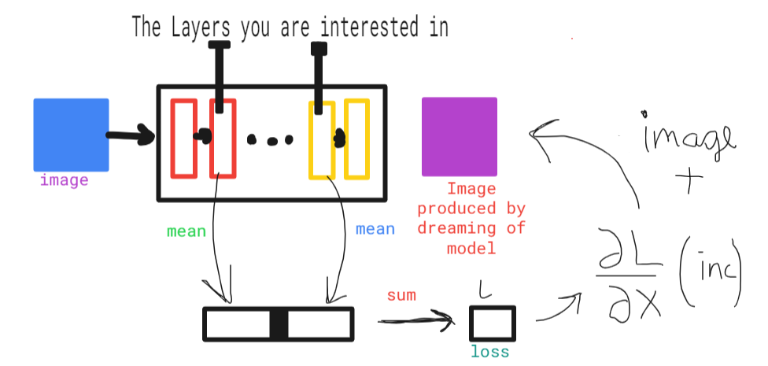
* For understanding DreamNet in detail see the jupyter notebook
---
## Results
* ### Monalisa: `mixed0` to `mixed10`
    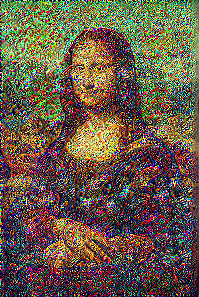 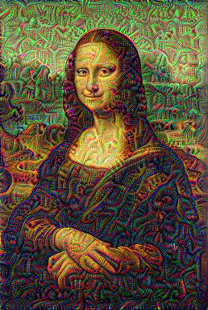 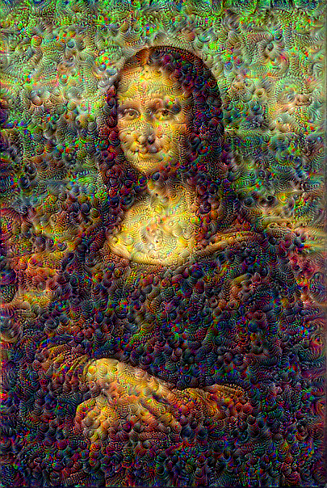 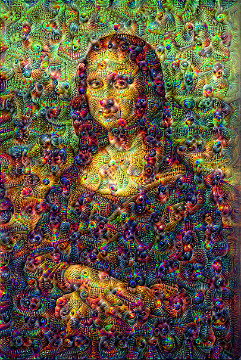 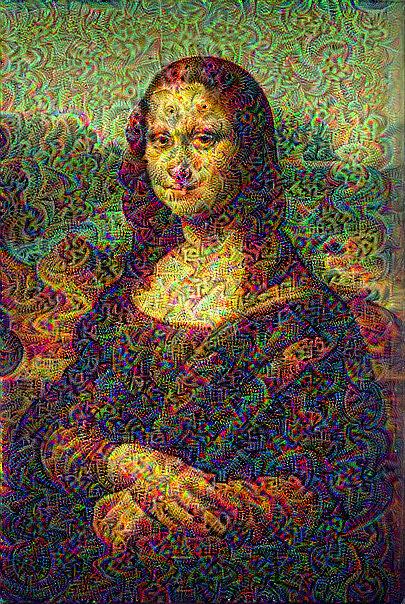 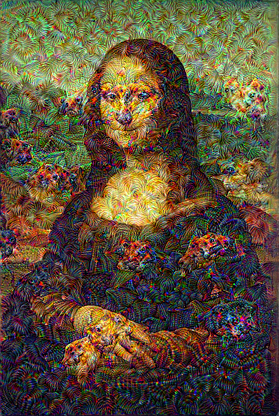 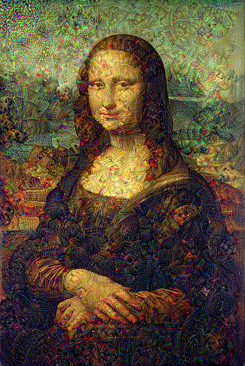 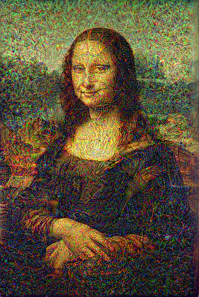 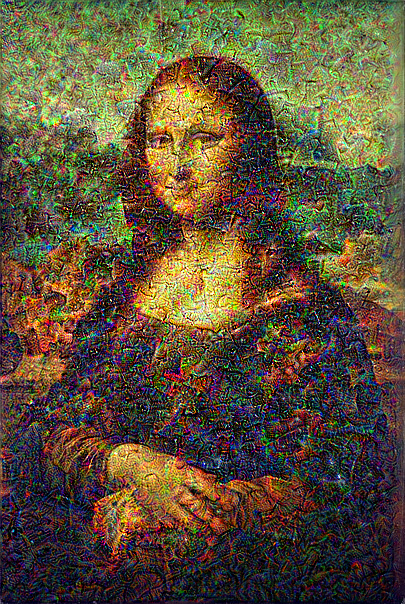 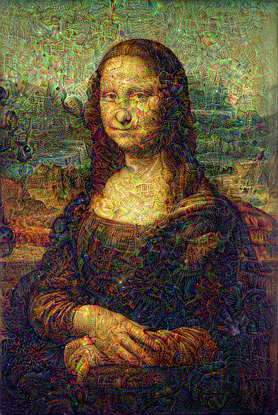 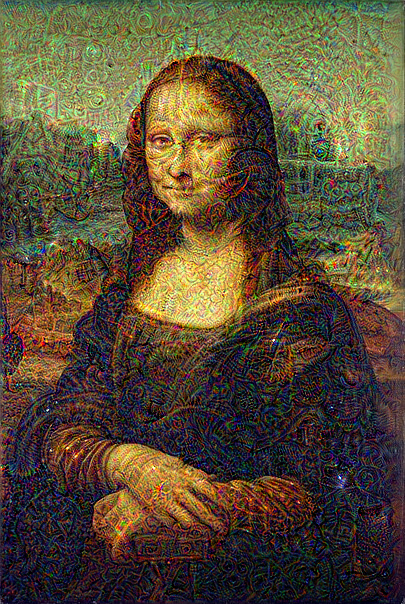
* ### Sky: `act30` and `mixed3`
  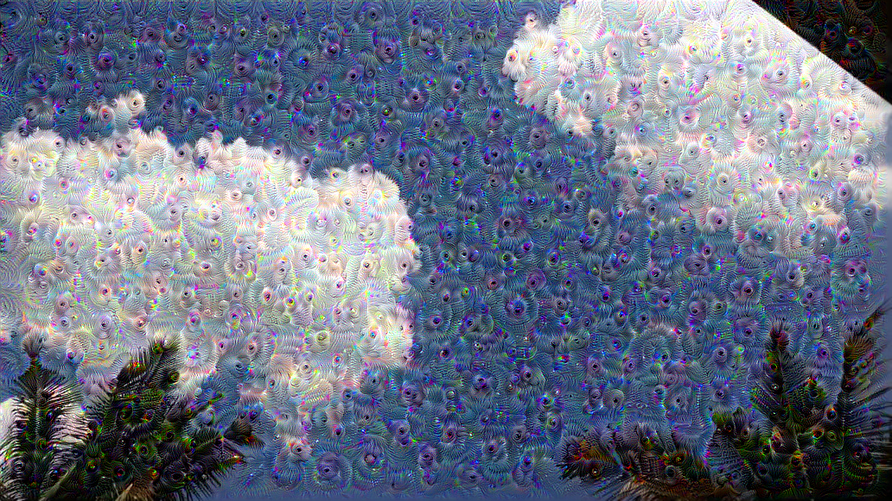 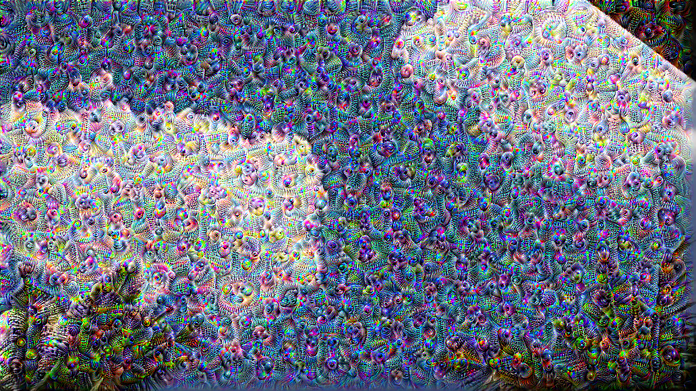
* ### Scenery:
  
   
  
  
## Ablations
* Without clipping the gradients, the images are disrupted
  
  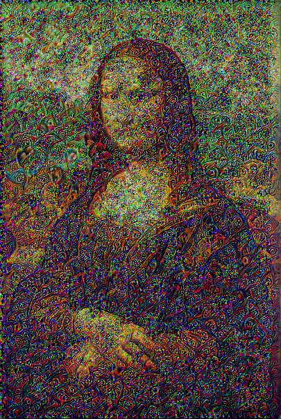
* Not normalizing the gradients doesn't affect the resultant image, therefore you should normalize the gradients to see the results
---
### Further Inspection which can be done
* The following repo was created using the Inception Model pre-trained on Imagenet which contains many classes
* Will update this repo to include results by different pre-trained Models, and then finetuned on different tasks like dog classification,...

### References
* [Inceptionism: Going Deeper into Neural Networks](https://blog.research.google/2015/06/inceptionism-going-deeper-into-neural.html)
